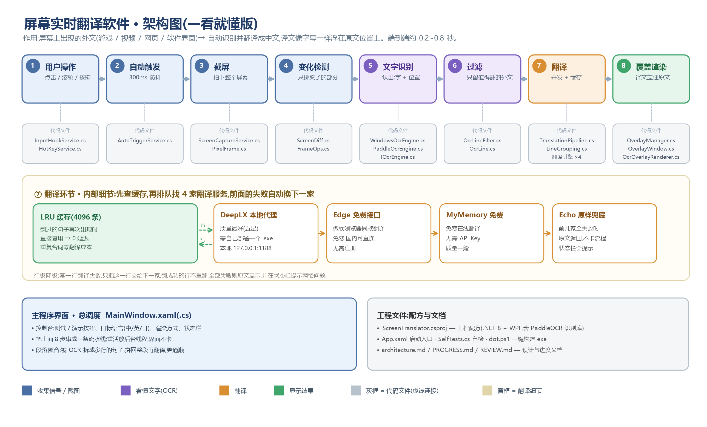

<div align="center">

# 🖥️ ScreenTranslator · 屏幕实时翻译

**看到即翻译** —— 屏幕上的外文(游戏 / 视频 / 网页 / 软件界面),自动识别并翻译成中文,译文像字幕一样浮在原文位置上。

`C#` `WPF` `OCR` `.NET 8` | 端到端延迟约 **0.2~0.8 秒**

</div>

---

## 📥 下载安装(推荐)

到 [Releases](https://github.com/OYAde4u/ScreenTranslator/releases) 下载 **ScreenTranslator-Setup-1.0.0.exe**,双击安装即可——
自包含打包,**无需安装 .NET 运行时**,无需管理员权限,装完桌面出现「屏幕实时翻译」快捷方式。

> 免安装版:clone 后 `pwsh -File tools\pack.ps1` 自动发布到 `publish\ScreenTranslator.exe`(打开 1 层文件夹即到 exe)。

---

## ✨ 功能特性

- 🎯 **原文位置覆盖**:OCR 精确定位文字坐标,译文以「字幕底块」样式盖住原文,不遮画面其他内容;
- ⚡ **只翻变化区域**:前后帧对比(64px 分块指纹),只有变了的地方才重新识别翻译,CPU 占用低;
- 🤖 **自动触发**:鼠标点击 / 滚轮 / 键盘按键后 300ms 防抖自动翻译;也可按 `Ctrl+Shift+T` 手动触发;
- 🌐 **四引擎降级链**:DeepLX(质量最好)→ Edge 免费接口 → MyMemory 免费 → Echo 兜底,前一家失败自动换下一家,永不卡死;
- 🗃️ **LRU 缓存(4096 条)**:翻过的句子再次出现直接复用,延迟为 0,重复台词零成本;
- 📚 **段落聚合翻译**:一句话被 OCR 拆成多行时先拼回整段再翻译,译文更通顺;
- 🖥️ **多显示器支持**:逐显示器截图与覆盖,任意 DPI 组合下坐标精确对齐;
- 🔤 **目标语言可选**:中文 / 英文 / 日文;自动过滤已为目标语言的内容与垃圾文本(网址、纯数字等);
- 🎨 **两种渲染方式**:字幕底块(默认,适配一切背景)/ 背景采样覆盖(纯色背景原位替换)。

## 🖼️ 工作流程与架构

```
① 用户操作 ─► ② 自动触发 ─► ③ 截屏 ─► ④ 变化检测 ─► ⑤ 文字识别(OCR) ─► ⑥ 过滤 ─► ⑦ 翻译 ─► ⑧ 覆盖渲染
  点击/滚轮/     300ms 防抖    拍下整个     只挑变了      认出:字 + 位置    只留值得翻     并发 + 缓存   译文盖住原文
   按键           才动手       屏幕         的部分                           的外文
```



> 完整的零基础架构说明见 [`架构图.md`](架构图.md);面向开发者的设计文档见 [`architecture.md`](architecture.md)。

## 🚀 快速开始

### 环境要求

- Windows 10/11(x64)
- [.NET 8 SDK](https://dotnet.microsoft.com/download/dotnet/8.0)
- 可选:本地部署 [DeepLX](https://github.com/OwO-Network/DeepLX)(翻译质量最佳,默认地址 `127.0.0.1:1188`)

### 构建

```powershell
# 一键构建(输出 bin\Debug\net8.0-windows10.0.19041.0\ScreenTranslator.exe)
.\tools\dot.ps1 build

# 或直接使用 dotnet
dotnet build ScreenTranslator\ScreenTranslator.csproj
```

> 依赖 NuGet 包(PaddleOCRSharp 等)需可访问 NuGet 源;若处于离线/受限网络环境,可用 `tools\install-nupkg.ps1` 预先手动安装到本地包缓存。

### 运行

```powershell
.\ScreenTranslator\bin\Debug\net8.0-windows10.0.19041.0\ScreenTranslator.exe
```

## 🎮 使用方法

1. **启动程序**,点「测试:截图 + 识别 + 覆盖」手动翻一次;或点「演示」弹出一个英文测试页,1.5 秒后自动翻译,立刻看到悬浮译文;
2. 勾选 **自动触发** 后,鼠标点击 / 滚轮 / 键盘按键都会触发翻译(300ms 防抖,只翻变化区域);
3. 按 **Ctrl+Shift+T** 随时手动翻译一次;
4. 通过下拉框切换 **目标语言**(中文/英文/日文)与 **渲染方式**(字幕底块/背景采样);
5. 点「清除覆盖层」可随时清掉屏幕上的译文。

## 🔍 识别引擎

| 引擎 | 说明 | 状态 |
|---|---|---|
| **RapidOCR(PP-OCRv6 small 多语,ONNX)** | 整屏/任意区域高质量识别,真实置信度 + 四角点坐标,支持中/英/日(假名);无框大小限制 | ✅ 默认主引擎 |
| **Windows.Media.Ocr** | 系统自带、零依赖、整屏稳定;小字/中文错字较多,作兜底 | 🛟 兜底(模型缺失/异常时自动切换) |
| **PaddleOCRSharp(PP-OCRv5)** | 质量高但社区版整屏触发 "box sizes <100" 返回 0 行,仅保留作诊断自检 | 🧪 诊断用 |

> 实测(2560x1600 真实整屏):RapidOCR 识别 116 行、中文无错字;Windows OCR 同屏中文逐字插空格且错字多(如 `HeIlo`、`RO c ksta r`)。PP-OCRv6 模型(~31MB)已内置在 `ScreenTranslator/models/v6/`(SHA256 已校验),构建时自动拷贝到输出目录;首次识别需加载模型(约 1~2 秒,之后常驻)。

## 🌐 翻译引擎(降级链)

| 顺序 | 引擎 | 说明 |
|---|---|---|
| 1 | **DeepLX** | DeepL 免费接口的本地代理,质量最好;需自部署一个 exe(默认 `127.0.0.1:1188`) |
| 2 | **Edge** | 微软浏览器同款免费接口,国内可直连,无需注册 |
| 3 | **MyMemory** | 免费在线翻译,无需 API Key,质量一般 |
| 4 | **Echo** | 兜底:原样返回,保证流程不卡死,并在状态栏提示网络问题 |

**行级降级**:某一行翻译失败,只把这一行交给下一家,翻译成功的行不重翻 —— 不因个别行失败导致整批重翻。

## 📁 项目结构

```
ScreenTranslator/
├── ScreenTranslator/              # 主程序源码
│   ├── App.xaml(.cs)              # 程序启动入口
│   ├── MainWindow.xaml(.cs)       # 主界面 + 总调度(串起整条流水线)
│   └── Services/
│       ├── Ocr/                   # 文字识别:引擎抽象 + RapidOCR(主)+ Windows OCR(兜底)+ PaddleOCR(诊断)+ 过滤
│       ├── Translate/             # 翻译:管道(缓存/并发/降级)+ 4 家引擎 + 段落聚合
│       ├── ScreenCaptureService.cs # 截屏(逐显示器 BitBlt)
│       ├── ScreenDiff.cs          # 分块指纹变化检测
│       ├── OverlayManager.cs / OverlayWindow.cs / OcrOverlayRenderer.cs  # 透明覆盖层渲染
│       ├── AutoTriggerService.cs / HotKeyService.cs / InputHookService.cs # 自动触发与热键
│       └── DisplayLayout.cs / FrameOps.cs / PixelFrame.cs / Diag.cs       # 工具与日志
├── tools/                         # 开发脚本:dot.ps1(一键构建)、install-nupkg.ps1(离线装包)、render/check-diagram.ps1(架构图)
├── 架构图.md / architecture-diagram.png  # 零基础架构图(由 tools\render-diagram.ps1 生成)
├── architecture.md                # 架构设计文档
└── PROGRESS.md / REVIEW.md        # 开发进度与代码审查记录
```

## ⚙️ 技术栈

- **语言/框架**:C# / WPF,.NET 8(`net8.0-windows10.0.19041.0`)
- **截图**:GDI+ BitBlt(逐显示器,物理像素)
- **OCR**:RapidOcrNet(PP-OCRv6 small 多语 ONNX,主)+ Windows.Media.Ocr(兜底)
- **渲染**:WPF 透明置顶窗口 + SetWindowRgn 裁剪,双缓冲增量绘制
- **翻译**:HTTP 客户端调用多家免费服务,信号量限流并发

## 📈 性能设计

| 阶段 | 预算 |
|---|---|
| 变化检测(分块哈希) | ~5ms |
| 截屏 | 5~20ms |
| OCR(RapidOCR,仅脏区) | 小区域 ~0.3~1s;首次调用含模型加载 1~2s;整屏约 2~4s |
| 过滤 + 缓存命中 | <1ms / 0ms |
| 翻译(批量 + 并发) | 100~500ms,缓存命中 0ms |
| 覆盖绘制(增量) | 5~20ms |

## ❓ 常见问题

- **翻出来全是原文?** 说明 4 家翻译服务均不可用 —— 检查网络,或本地启动 DeepLX(质量最佳);
- **演示页没有出现译文?** 首次全屏 OCR 需要几秒,请稍候;确认屏幕上有外文内容(已是中文的内容会被自动过滤);
- **自动触发不灵敏?** 防抖 300ms + 冷却 800ms 是刻意的:拖动窗口、连续滚动时不会狂刷,停一下才翻;
- **游戏/视频中截屏发黑?** 独占全屏的窗口 BitBlt 会截到黑屏,请改为无边框/窗口化运行。

## 📄 许可

本项目仅供学习交流使用,代码采用 MIT 协议;依赖的 OCR / 翻译服务版权归各自作者所有。
